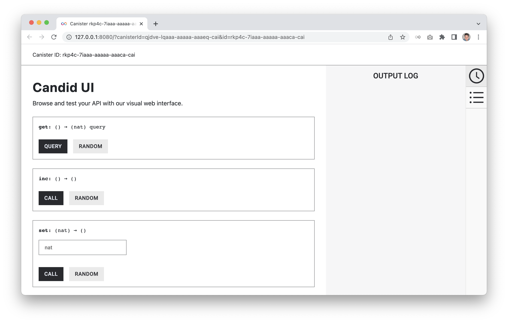

# Candid Guide

## What is Candid
Candid is an interface describing the public services deployed in canisters on the Internet Computer. The Candid interface allows inter-operation between services, and between services and frontends, independently of the programming language used. 

The purpose of the Candid interface is similar to the purpose of a REST API, but where APIs typically use JSON to exchange data, Candid is an *Interface Description Language (IDL)*. IDL is platform and programming language neutral, and descibes the service, data formats, data structures etc. Read more about Candid in the [documentation](https://internetcomputer.org/docs/current/developer-docs/build/candid/candid-intro).

## The DID-file
The Candid interface is automatically generated when building a Motoko project, but it can also be written manually. In its simplest form, the Candid DID-file contains a service description. The [Counter example dapp](https://github.com/dfinity/examples/tree/master/motoko/counter) is a good example of a minimalistic dapp, with a very small and simple Candid file. When the project is deployed, the `counter.did` file will contain this service description:

```
service : {
  get: () -> (nat) query;
  set: (nat) -> ();
  inc: () -> ();
}
```

The Counter dapp has three public functions: `get()`, `set(nat)` and `inc()`. From the service description we can see, that the get() function returns a number, and the service is a query function (faster execution). The set takes a number as an argument, but doesn't return anything, and inc() doesn't take an argument and doesn't return anything. 

See more advanced uses of Candid in the [documentation](https://internetcomputer.org/docs/current/developer-docs/build/candid/candid-concepts) or in other [Motoko examples](https://github.com/dfinity/examples/tree/master/motoko).

## How to use the Candid interface
The Candid interface, as previously mentioned, allows inter-operation between services, and between services and frontends. Candid is also very useful for calling the public services from commandline, or using the Candid UI.

### Using Candid in frontend
The [Hello example dapp](https://github.com/dfinity/examples/tree/master/motoko/hello) has both a backend and a frontend, and the frontend imports the backend services through the Candid interface. The project's source folder (src) have three folders: `declarations`, `hello` (backend) and `hello_assets` (frontend). Let's examine the frontend's Javascript file located in `/src/hello_assets/src/index.js`:

```javascript
import { hello } from "../../declarations/hello";

document.querySelector("form").addEventListener("submit", async (e) => {
  e.preventDefault();
  document.getElementById("greeting").innerText = "";
  const loader = document.getElementById("loader");

  const button = e.target.querySelector("button");

  const name = document.getElementById("name").value.toString();

  loader.style.visibility = "visible";
  button.setAttribute("disabled", true);
  document.getElementById("name").setAttribute("disabled", true);

  // Interact with foo actor, calling the greet method
  const greeting = await hello.greet(name);

  loader.style.visibility = "hidden";
  button.removeAttribute("disabled");
  document.getElementById("name").removeAttribute("disabled");
  document.getElementById("greeting").innerText = greeting;

  return false;
});
```

Two lines of code in this file is worth paying attention to, with regards to Candid. The first line is where the Candid service description is imported, and in this case it's actually not the hello.did file but the index.js file. The Candid index.js is automatically generated when the project is built, and imports the Motoko backend's services.

```javascript
import { hello } from "../../declarations/hello";
```
After importing the Candid interface we can now use the public backend service, which is illustrated in this line:

```javascript
const greeting = await hello.greet(name);
```
The update function `greet()` is called with the name as a parameter, which will update the current stored name, and return the hello-message. The call is asynchronous so an **await** is added so the frontend is waiting for a response before moving on. 

A number of agents are developed by both DFINITY and the community to easily integrate the Candid interface in different programming languages. See the [documentation](https://internetcomputer.org/docs/current/developer-docs/build/agents/) for a list of the available agents.

### Commandline
The Candid interface also allows for calling backend services/functions from commandline. This is useful for admin functions that doesn't necessarily needs a frontend, or for testing the backend. If we go back to the [Counter example dapp](https://github.com/dfinity/examples/tree/master/motoko/counter), which didn't have a frontend, we can call `get()`, `set()` and `inc()` from commandline.

```bash
$ dfx canister call counter get
(0 : nat)
```
```bash
$ dfx canister call counter set '(1)'
()
$ dfx canister call counter get
(1 : nat)
```
```bash
$ dfx canister call counter inc
()
$ dfx canister call counter get
(2 : nat)
```
For more information about how to call canisters from commandline, see the [documentation](https://internetcomputer.org/docs/current/references/cli-reference/dfx-canister).

### Candid UI
While the commandline can be very practical, there's also an easier way to call the backend services, and that's by using the Candid UI. When a project is deployed, besides the Candid interfaces, an asset canister running the Candid UI is also deployed. The built process will show the URL in the console, but the URL can also be found in `counter/.dfx/local/canister_ids.json`:

```json
{
  "__Candid_UI": {
    "local": "qjdve-lqaaa-aaaaa-aaaeq-cai"
  },
  "counter": {
    "local": "rkp4c-7iaaa-aaaaa-aaaca-cai"
  }
}
```
In this case the URL to the Candid UI is http://127.0.0.1:8080/?canisterId=qjdve-lqaaa-aaaaa-aaaeq-cai&id=rkp4c-7iaaa-aaaaa-aaaca-cai

Simply click the **Call** and **Query** buttons, and see the response in the Output Log.



### Motoko Playground


## Useful links


